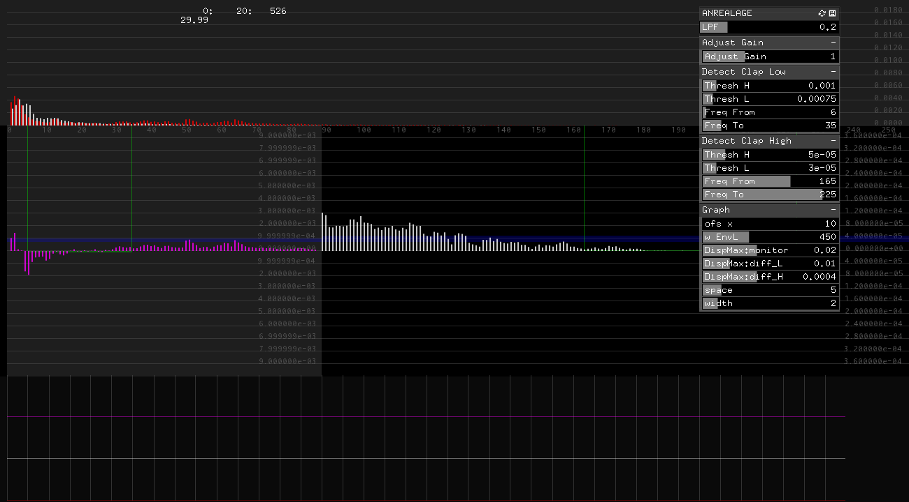

# work__ANREALAGE_2018_JapanHouse__DetectClap #

## 環境 ##
*	OS X El Capitan(10.11.6)
*	Xcode : 7.2
*	oF : 0.9.0

## add on ##
ofxGui  
ofxOsc  
ofxXmlSettings  

## Contents ##
会場内音楽を再生.  
これをMacからSplitし、片chをSpeakerに接続、もう片chをAudio I/FのLchに接続.  
Audio I/FのRchにはMicを接続.  
Audio I/FのLR chには、ほぼ同じ音源が入ってくるはず.  
Mac、Audio I/F、本AppのGainでこれを調整しておくと、Clapをdetectできるのが、本App.  
clapによる、高域の盛り上がりと、低域の突入波形を同時検出した時にclap detectと判定.  
通常の音源には、高域成分が少なく、これを使うことで、いい感じに判別できたが、
高域のみだと、ビニールや紙などのカサカサ音で誤判別してしまった.  
そこで、高域 + 低域の合わせ技で判別するよう工夫した.  

  

## Device ##

## note ##

